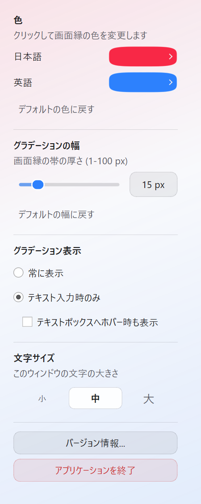

<p align="center">
  
</p>

# IME Aura

IME Aura は、現在の IME 入力状態（日本語入力か英語入力か）に応じて、画面の縁にグラデーションを表示するオーバーレイツールです。Windows / macOS / Linux で動作します。入力状態を視覚的に把握しやすくすることで、入力ミスを防げます。

## プロジェクト構成

```
IMEAura/
├── ime_aura/
│   ├── __main__.py          # python -m ime_aura
│   ├── main.py              # Application entry
│   ├── resources.py         # Resource path resolution
│   ├── settings.py          # Persistent settings
│   ├── platform/            # OS-specific IME / screen detection
│   │   ├── base.py
│   │   ├── windows.py
│   │   ├── macos.py
│   │   └── linux.py
│   └── ui/
│       ├── theme.py         # Signal Edge tokens + stylesheet (HIG-aligned)
│       ├── widgets.py       # Squircle swatches, feedback buttons
│       ├── icons.py         # SVG icon loading
│       ├── overlay.py       # Edge gradient overlay
│       ├── control_window.py
│       └── about_dialog.py  # Version / license notices
├── img/
│   ├── icon.svg             # Runtime UI / window icon
│   ├── icon.png
│   ├── icon.ico
│   └── icon.icns              # macOS app bundle icon
├── requirements.txt
├── LICENSE
├── THIRD_PARTY_NOTICES.md   # Third-party notices
└── README.md
```

## 特徴

- **リアルタイムな状態検知**: アクティブな入力状態を取得し、日本語入力か英語入力かを判定します。
- **画面縁のグラデーション**: 状態に応じて画面の縁にグラデーションを描画します。
- **マルチディスプレイ対応**: アクティブウィンドウがあるディスプレイに自動で追従します（環境により制限あり）。
- **色のカスタマイズ**: コントロールウィンドウから、日本語入力時・英語入力時の色（透明度含む）を変更できます。色・表示モード・グラデーション幅は次回起動時も保持されます。
- **表示モード**: グラデーションを常時表示するか、テキスト入力時のみ表示するかを選べます。テキスト入力時のみのとき、テキストボックスへのホバーでも表示するかを追加で選べます。
- **入力透過**: オーバーレイはクリック等を透過するため、作業の邪魔になりません。
- **長時間・スリープ耐性 (Windows)**: IME 問い合わせにタイムアウトを設け、テキスト入力検知 (UIA/MSAA) を UI スレッド外で行うため、スリープ復帰後や応答しないアプリがあってもオーバーレイが止まりにくくなっています。

## 動作環境

| OS | IME 検知 | 画面追従 | テキスト入力検知 |
| --- | --- | --- | --- |
| Windows | IMM32（フォーカス窓優先・タイムアウト付き） | アクティブウィンドウ | ウィンドウクラス + UIA + MSAA |
| macOS | Carbon Text Input Source | Quartz（失敗時はカーソル位置） | Accessibility（許可が必要な場合あり） |
| Linux | Fcitx5 または IBus（自動検出） | X11 + `xdotool`（Wayland はカーソル位置にフォールバック） | AT-SPI（`python3-gi` + Atspi がある場合） |

- Python 3.10+
- PySide6
- Linux では Fcitx5（`fcitx5-remote`）または IBus が必要です。どちらも無い場合は常に英語入力として表示されます。

## インストール

1. Python がインストールされていることを確認します。
2. 依存ライブラリをインストールします。

```bash
pip install -r requirements.txt
```

## 使い方

プロジェクトのルートディレクトリで次を実行します。

```bash
python -m ime_aura
```

起動すると、画面の縁にグラデーションが表示され、小さなコントロールウィンドウも開きます。

### Control window

<p align="center">
  
</p>

The control window uses a **Signal Edge** layout: one section per task, capsule color chips (corner radius = 50% of height), and quieter secondary actions. Window chrome stays native. Padding is fixed, so buttons, chips, and row gaps stay even while heights follow the selected text size.

- **Colors**: Capsule swatches open a styled color picker, including alpha (checkerboard shows transparency). A trailing chevron, hover scale, and tooltip mark them as clickable. Restore defaults with the quiet text button; it briefly reads "戻しました".
- **Gradient width**: The slider and pixel value sit on one row (1–100 px). Restore the default (15 px) when needed.
- **Gradient visibility**:
  - **Always** / **Only while typing** (mutually exclusive)
  - **Also show when hovering a text box**: slides open only when “Only while typing” is selected
- **Text size**: Segmented Small / Medium / Large control (11 / 13 / 16 pt). The selected segment slides under the label.
- **About…**: Shows license and third-party notices (SVG app icon).
- **Quit**: Asks for confirmation, then exits the entire application (overlay included).

The panel fades in on open. Motion respects the OS "reduce motion" / "minimize animations" setting. Settings (colors, width, display mode, font size) persist across launches. The panel scrolls vertically only (no horizontal scroll).

## 実行ファイルの作成

PyInstaller でフォルダ形式（`--onedir`）の配布物を作成できます。LGPL ライブラリ（PySide6 / Qt）の差し替えに配慮し、単一ファイル（`--onefile`）ではなく `--onedir` を使用します。`LICENSE` と `THIRD_PARTY_NOTICES.md` も同梱されます。

1. PyInstaller をインストールします。

```bash
pip install pyinstaller
```

2. プロジェクトのルートでビルドします。

**Windows:**

```bash
pyinstaller --noconsole --onedir --icon=img/icon.ico --add-data "img/icon.ico;img" --add-data "img/icon.svg;img" --add-data "LICENSE;." --add-data "THIRD_PARTY_NOTICES.md;." -n IMEAura ime_aura/__main__.py
```

**Linux:**

```bash
pyinstaller --noconsole --onedir --icon=img/icon.ico --add-data "img/icon.ico:img" --add-data "img/icon.svg:img" --add-data "LICENSE:." --add-data "THIRD_PARTY_NOTICES.md:." -n IMEAura ime_aura/__main__.py
```

**macOS:**

`.app` バンドルには `img/icon.icns` を指定します（実行時アイコン用の `icon.ico` は引き続き同梱します）。

```bash
pyinstaller --noconsole --onedir --icon=img/icon.icns --add-data "img/icon.ico:img" --add-data "img/icon.svg:img" --add-data "LICENSE:." --add-data "THIRD_PARTY_NOTICES.md:." -n IMEAura ime_aura/__main__.py
```

3. 完了後、Windows / Linux は `dist/IMEAura/`、macOS は `dist/IMEAura.app` に成果物が生成されます。この一式を配布してください。

## GitHub リリースの自動作成

`main` ブランチへプッシュするたびに、GitHub Actions が Windows / Linux / macOS 版アプリケーションをビルドし、新しいプレリリースを作成します。リリースは `v1.0.<GitHub Actions の実行番号>` 形式の一意なタグで作成され、プッシュされたコミットを指します。

各リリースの Assets には、次の zip が添付されます。

| Asset | 対象 | 展開後 |
| --- | --- | --- |
| `IMEAura-windows-x64.zip` | Windows (x64) | フォルダ内の `IMEAura.exe` |
| `IMEAura-linux-x64.zip` | Linux (x64) | フォルダ内の `IMEAura` |
| `IMEAura-macos-arm64.zip` | macOS (Apple Silicon) | `IMEAura.app` |

## ライセンス

- **IME Aura（本プロジェクト）**: MIT License（`LICENSE` を参照）
- **第三者ソフトウェア**: `THIRD_PARTY_NOTICES.md` を参照

主な依存である PySide6 / Qt は、LGPL-3.0 / GPL-2.0 / GPL-3.0（または Qt 商用ライセンス）のもとで提供されます。アプリの「バージョン情報」からも同じ内容を確認できます。
